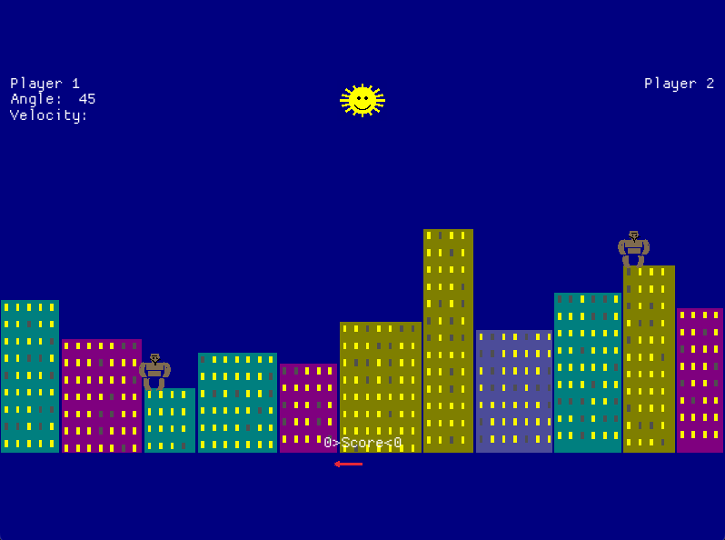

# Gorilla.rs

A faithful Rust port of the classic **QBasic Gorillas** game from 1991.

Two gorillas stand atop buildings in a city skyline, taking turns hurling explosive bananas at each other. Adjust your angle and velocity, account for wind and gravity, and try to hit your opponent before they hit you.

## Play Online

**[Play in your browser](https://jimmystridh.github.io/gorilla.rs/)** (WebAssembly)

## Screenshot



## Installation

### Download Binary

Grab the latest release for your platform from [Releases](https://github.com/jimmystridh/gorilla.rs/releases):

| Platform | Download |
|----------|----------|
| Linux (x86_64) | `gorillas-linux-amd64.tar.gz` |
| Linux (ARM64) | `gorillas-linux-arm64.tar.gz` |
| macOS (Intel) | `gorillas-macos-amd64.tar.gz` |
| macOS (Apple Silicon) | `gorillas-macos-arm64.tar.gz` |
| Windows (x86_64) | `gorillas-windows-amd64.zip` |
| Windows (ARM64) | `gorillas-windows-arm64.zip` |
| Web | `gorillas-web.zip` |

### Build from Source

```bash
# Clone the repository
git clone https://github.com/jimmystridh/gorilla.rs.git
cd gorilla.rs

# Build and run
cargo run --release
```

### Build for WebAssembly

```bash
rustup target add wasm32-unknown-unknown
cargo build --release --target wasm32-unknown-unknown
cp target/wasm32-unknown-unknown/release/gorillas.wasm .
python3 -m http.server 8000
# Open http://localhost:8000
```

## How to Play

1. **Enter player names** (or press Enter for defaults)
2. **Set number of games** to play
3. **Set gravity** (9.8 for Earth, try lower for Moon-like physics)
4. Press **P** to play or **V** to view the intro animation

### Controls

| Key | Action |
|-----|--------|
| `0-9`, `.` | Enter angle/velocity |
| `Enter` | Confirm input |
| `Backspace` | Delete character |
| `Cmd/Ctrl + Enter` | Toggle fullscreen |
| `Escape` | Quit game |

### Gameplay

- Enter an **angle** (0-90 degrees) for your throw
- Enter a **velocity** (power of your throw)
- Watch the banana fly through the air
- Account for **wind** (shown by arrow at bottom of screen)
- Hit your opponent to score a point
- First to reach the target score wins

## Original Game

This is a port of `GORILLA.BAS`, which shipped with MS-DOS 5.0 and QBasic in 1991. The original was created by IBM Corporation and became one of the most iconic games of the early PC era.

## Technical Details

- Written in Rust using [macroquad](https://github.com/not-fl3/macroquad) for cross-platform graphics
- Compiles to native binaries for Linux, macOS, and Windows
- Compiles to WebAssembly for browser play
- Faithful recreation of original 640x350 EGA graphics, scaled to any resolution
- Original physics and gameplay mechanics preserved

## License

This is a fan recreation of the original QBasic Gorillas for educational and nostalgic purposes.

## Credits

- **Original Game**: IBM Corporation (1991)
- **Rust Port**: Created with assistance from Claude

---

*"Your mission is to hit your opponent with the exploding banana by varying the angle and power of your throw, taking into account wind speed, gravity, and the city skyline."*
